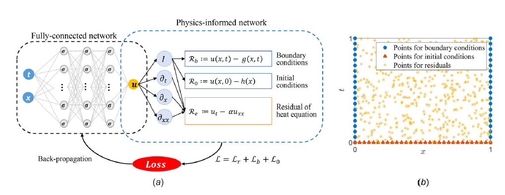

# HeatTransferPINN



**Descrição da Figura:** (a) Formato esquemático do funcionamento de uma rede neural informada pela física (PINN). (b) Pontos relacionados a condições iniciais, de contorno e de resíduos (domínio). **Fonte:** Retirado de Cai et.al (2021)

## Sobre o repositório

Materiais computacionais da disciplina **Tópicos Especiais em Transferência de Calor utilizando Redes Neurais Informadas por Física (PINNs)**.

O repositório será atualizado ao longo da disciplina com notebooks, exemplos, listas de exercícios e materiais de apoio. A proposta é conectar a física da transferência de calor, os métodos numéricos convencionais e o aprendizado de máquina científico por meio de implementações em Python.

## Sobre a disciplina

### Objetivo

Compreender os mecanismos de transferência de calor, especialmente **condução** e **convecção**, e integrar suas equações diferenciais ao treinamento de Redes Neurais Informadas por Física com Python.

### Conteúdos principais

- Equação de condução e difusão de calor;
- Simplificações para problemas unidimensionais e bidimensionais;
- Equações de Fourier-Biot, Poisson e Laplace;
- Convecção e solução de Blasius para camadas-limite hidrodinâmica e térmica;
- Métodos de diferenças finitas, Runge-Kutta e shooting;
- Fundamentos de redes neurais artificiais e perceptrons multicamadas;
- Formulação matemática e computacional de PINNs;
- Problemas diretos, inversos e paramétricos em transferência de calor;
- Aplicações em problemas de engenharia mecânica e de energia.

O conhecimento prévio recomendado inclui **equações diferenciais ordinárias, cálculo numérico e transferência de calor**. Não é necessário já conhecer PINNs ou DeepXDE: esses conceitos serão construídos progressivamente durante as aulas.

## Como utilizar este repositório

### Opção recomendada: Google Colab

1. Abra o notebook pelo botão **Open in Colab** abaixo.
2. Execute as células em ordem, de cima para baixo.
3. Leia os textos e observe as figuras antes de modificar os códigos.
4. Depois, altere os parâmetros e repita os experimentos para investigar o comportamento da solução e do treinamento.

### Execução local

```bash
git clone https://github.com/Paulo-de-Souza/HeatTransferPINN.git
cd HeatTransferPINN

python -m venv .venv
source .venv/bin/activate       # Linux/macOS
# .venv\Scripts\activate       # Windows

pip install deepxde numpy matplotlib jupyter
jupyter notebook
```

O notebook utiliza o **DeepXDE**. A biblioteca pode trabalhar com diferentes backends; nos exemplos atuais, o backend utilizado é o TensorFlow. Caso seja necessário configurá-lo manualmente:

```bash
pip install tensorflow
export DDE_BACKEND=tensorflow        # Linux/macOS
# set DDE_BACKEND=tensorflow         # Windows
```

No Google Colab, a primeira célula do notebook instala o DeepXDE. O tempo de treinamento pode variar conforme o ambiente, o backend, a quantidade de pontos e a inicialização aleatória da rede.

## Notebook disponível

| Material | Conteúdo | Situação | Abrir no Colab
|---|---|---|---|
| [`Aula00_HeatDeepXDE.ipynb`](Notebooks/Aula00_HeatDeepXDE.ipynb) | Problemas diretos e inversos de calor e difusão utilizando DeepXDE | Disponível | [](https://colab.research.google.com/github/Paulo-de-Souza/HeatTransferPINN/blob/main/Notebooks/Aula00_HeatDeepXDE.ipynb) |

### O que é estudado no notebook base

#### 1. Problema direto: equação do calor

É resolvida a equação

$$
\frac{\partial u}{\partial t}=\alpha\frac{\partial^2u}{\partial x^2},
\qquad x\in[0,1],\quad t\in[0,1],
$$

com condição inicial senoidal e condições de contorno de Dirichlet nulas. A solução exata é utilizada para comparar:

- a solução de referência;
- a solução prevista pela PINN;
- o erro absoluto espaço-temporal.

O exemplo utiliza comprimento da barra `L = 1`, modo inicial `n = 1` e difusividade térmica `alpha = 0.4`.

#### 2. Problema direto: equação de difusão com termo-fonte

Em seguida, é considerada uma equação de difusão em `x ∈ [-1, 1]`, com termo-fonte construído a partir de uma solução conhecida. Esse exemplo ajuda a distinguir a equação de calor, como um caso particular de difusão, de uma equação de difusão com fonte explícita.

#### 3. Problema inverso: identificação de `k`

O parâmetro `k` da equação

$$
\frac{\partial T}{\partial t}=k\frac{\partial^2T}{\partial x^2}
$$

é tratado como uma variável treinável. A rede recebe observações de temperatura e utiliza simultaneamente:

- o resíduo da equação diferencial;
- a condição inicial;
- as condições de contorno;
- observações pontuais da solução.

O valor de referência é `k = 0.4`. O notebook apresenta dois cenários de inicialização, começando com `k = 5.0` e com `k = 1.0`, para observar como a estimativa evolui durante o treinamento.

| Cenário | Observações utilizadas | Estimativa inicial | Valor de referência |
|---|---|---:|---:|
| Identificação de `k` | 10 pontos ao longo da barra em `t = 0.5` | `k = 5.0` ou `k = 1.0` | `k = 0.4` |

#### 4. Problema inverso: identificação de `C`

Também é estudada a equação de difusão com termo-fonte, agora com um coeficiente desconhecido `C`. Nesse caso, o valor de referência é `C = 1.0`, enquanto o treinamento começa com uma estimativa inicial diferente.

Neste experimento, são utilizadas 10 observações ao longo do domínio em `t = 1.0`, com estimativa inicial `C = 2.0`.

Esse exemplo mostra como uma PINN pode ser utilizada não apenas para aproximar uma solução, mas também para inferir parâmetros físicos a partir de dados e das leis de conservação representadas pela equação diferencial.

## Conceitos de PINNs explorados

Ao longo dos notebooks, a rede neural aproxima o campo físico, por exemplo `u(x,t)` ou `T(x,t)`. A função de perda combina diferentes informações do problema:

$$
\mathcal{L}=\mathcal{L}_{\mathrm{PDE}}
 +\mathcal{L}_{\mathrm{CC}}
 +\mathcal{L}_{\mathrm{CI}}
 +\mathcal{L}_{\mathrm{dados}}.
$$

Em termos gerais:

- `L_PDE` penaliza a violação da equação diferencial nos pontos internos do domínio;
- `L_CC` penaliza a violação das condições de contorno;
- `L_CI` penaliza a violação da condição inicial;
- `L_dados` aproxima as observações disponíveis.

Nos problemas inversos, o parâmetro físico desconhecido também participa do treinamento. Assim, a rede procura uma solução que seja simultaneamente compatível com a física, com as condições impostas e com os dados observados.

O notebook também permite observar o uso de diferenciação automática, dos otimizadores **Adam** e **L-BFGS**, do erro relativo `L2` e de métricas de erro absoluto.

## Mapa da disciplina

O cronograma possui 12 aulas de quatro horas semanais. Os materiais serão disponibilizados progressivamente.

| Aula | Modalidade | Tema | Material no repositório |
|---:|---|---|---|
| 01 | Teórica | Introdução, motivações e dedução da equação de difusão de calor | Em organização |
| 02 | Teórica | Simplificações da equação de difusão em 1D e 2D | A disponibilizar |
| 03 | Teórica | Convecção e solução de Blasius | A disponibilizar |
| 04 | Teórica | Solução por diferenças finitas, Runge-Kutta e shooting | A disponibilizar |
| 05 | Prática | Introdução à computação científica com Python | A disponibilizar |
| 06 | Teórica | Fundamentos de redes neurais artificiais | A disponibilizar |
| 07 | Teórica | Introdução às Physics-Informed Neural Networks | A disponibilizar |
| 08 | Prática | PINNs para problemas diretos | Em expansão a partir do notebook base |
| 09 | Prática | PINNs para problemas inversos | Em expansão a partir do notebook base |
| 10 | — | Dúvidas e alinhamentos | — |
| 11 | — | Apresentação de seminários | — |
| 12 | — | Apresentação de seminários | — |

O notebook base já reúne exemplos que serão aprofundados nas aulas práticas. A organização dos conteúdos em notebooks separados ocorrerá conforme a disciplina avançar.

## Avaliação

| Atividade | Peso | Descrição |
|---|---:|---|
| Lista Prática 1 | 10% | Exercícios teóricos de condução e convecção, após a Aula 03 |
| Lista Prática 2 | 20% | Resolução analítica ou numérica de problemas de condução 1D, 2D e da equação de Blasius com Python, após a Aula 05 |
| Lista Prática 3 | 20% | Resolução de problemas de condução e Blasius utilizando PINNs, após a Aula 07 |
| Projeto Final | 50% | Miniartigo em formato IEEE e seminário, desenvolvido individualmente ou em dupla |

A média final é calculada por

$$
\mathrm{MF}=0{,}1L_1+0{,}2L_2+0{,}2L_3+0{,}5P_F,
$$

com nota máxima igual a 10 em cada atividade. O projeto final deve aplicar uma PINN a um problema físico. Sempre que possível, recomenda-se adaptar a técnica a um tema relacionado à dissertação ou tese do estudante. O miniartigo deverá ter de 4 a 6 páginas no formato IEEE e a apresentação deverá durar no máximo 10 minutos.

## Sugestão de rotina de estudo

Para cada notebook, recomenda-se seguir esta sequência:

1. identificar a equação diferencial e as hipóteses físicas;
2. verificar o domínio, a condição inicial e as condições de contorno;
3. localizar no código o resíduo da equação (`pde`);
4. identificar como a rede e os pontos de treinamento são definidos;
5. acompanhar a função de perda e o processo de otimização;
6. comparar a previsão com a solução analítica, numérica ou dados disponíveis;
7. modificar uma hipótese ou parâmetro e interpretar o resultado.

Uma PINN não deve ser tratada apenas como uma caixa-preta. O objetivo é entender como cada termo físico aparece na formulação computacional e como as escolhas numéricas afetam a solução.

## Estrutura do repositório

```text
HeatTransferPINN/
├── Notebooks/
│   └── Aula00_HeatDeepXDE.ipynb
└── README.md
```

Novos diretórios e notebooks serão adicionados à medida que listas, exemplos de métodos convencionais, problemas de convecção e aplicações com PINNs forem desenvolvidos.

## Referências principais

- CAI, S. et al. *Physics-informed neural networks for heat transfer problems*. Journal of Heat Transfer, v. 143, n. 6, 2021.
- INCROPERA, F. P. et al. *Fundamentals of Heat and Mass Transfer*. 7. ed. Wiley, 2011.
- KAKAÇ, S.; YENER, Y.; NAVEIRA-COTTA, C. P. *Heat Conduction*. CRC Press, 2018.
- RAISSI, M.; PERDIKARIS, P.; KARNIADAKIS, G. E. *Physics-informed neural networks: A deep learning framework for solving forward and inverse problems involving nonlinear partial differential equations*. Journal of Computational Physics, v. 378, p. 686-707, 2019.
- QUARTERONI, S.; GERVASIO, P.; REGAZZONI, F. *Combining physics-based and data-driven models: advancing the frontiers of research with scientific machine learning*. arXiv, 2025.
- WANG, Y. et al. *Artificial intelligence for partial differential equations in computational mechanics: A review*. Applied Mechanics Reviews, 2024.

## Bibliografia complementar

- BOWMAN, B. et al. *Physics-informed neural networks for the heat equation with source term under various boundary conditions*. Algorithms, v. 16, n. 9, 2023.
- BUENO, V. et al. *Convergence analysis of physics-informed neural networks and comparison with finite difference methods of the two-dimensional heat equation*. Proceeding Series of the Brazilian Society of Computational and Applied Mathematics, v. 11, n. 1, 2025.
- KORIC, S.; ABUEIDDA, D. W. *Data-driven and physics-informed deep learning operators for solution of heat conduction equation with parametric heat source*. International Journal of Heat and Mass Transfer, v. 203, 2023.
- KRISHNA, G. et al. *Physics-informed neural networks approach to solve the Blasius function*. ICECCT, 2023.
- ÖZIŞIK, M. N. *Boundary Value Problems of Heat Conduction*. Courier Corporation, 1989.
- SHARMA, P. et al. *Stiff-PDEs and Physics-Informed Neural Networks*. Archives of Computational Methods in Engineering, v. 30, 2023.
- SHARMA, P. et al. *Hyperparameter selection for physics-informed neural networks (PINNs): application to discontinuous heat conduction problems*. Numerical Heat Transfer, Part B, v. 85, 2024.
- UDDIN, S. et al. *Deep Learning-Based PDE Solver: PINN Versus Classical Method for the 1D Heat Equation*. The Sciencetech, v. 6, 2025.
- ZOBEIRY, N.; HUMFELD, K. D. *A physics-informed machine learning approach for solving heat transfer equation in advanced manufacturing and engineering applications*. Engineering Applications of Artificial Intelligence, v. 101, 2021.

## Status

Este repositório está em construção. Os códigos serão revisados e ampliados ao longo das aulas. Sugestões, correções e dúvidas são bem-vindas por meio das *Issues* ou das discussões em sala.

